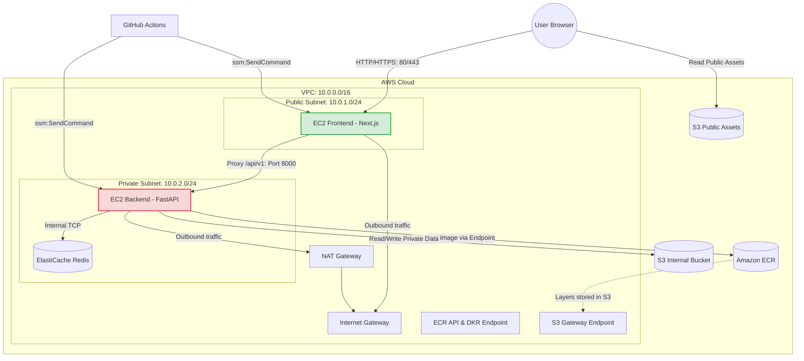

# Tài liệu Hướng dẫn Hạ tầng (Terraform Infrastructure)

Thư mục này chứa toàn bộ mã nguồn Terraform quản lý hạ tầng AWS cho dự án **Hire-Train AI**. Hạ tầng được thiết kế theo mô hình High-Security Multi-tier Network, phân chia rõ ràng phần công cộng (Frontend) và phần nội bộ (Backend, Redis).

---

## 1. Sơ đồ Kiến trúc Hệ thống

Dưới đây là sơ đồ luồng đi của dữ liệu và phân tách subnet:



---

## 2. Cấu trúc Thư mục

```text
infra/
├── modules/                   # Các Module con tái sử dụng
│   ├── vpc/                   # Quản lý VPC, Subnet, NAT, Endpoints
│   ├── ec2/                   # Khởi tạo EC2 Instance & Security Group
│   ├── ecr/                   # Đăng ký ECR Repo & Lifecycle Policy
│   ├── elasticache/           # Khởi tạo cụm Redis caching
│   ├── iam/                   # Thiết lập GHA OIDC Role và EC2 Profile
│   ├── s3_internal/           # S3 Bucket bảo mật lưu trữ nội bộ (CV)
│   └── s3_assets/             # S3 Bucket công khai chứa static assets
├── backend.tf                 # Khai báo backend lưu state file
├── main.tf                    # File liên kết và điều phối chính (Orchestration)
├── variables.tf               # Định nghĩa các biến đầu vào
├── outputs.tf                 # Khai báo dữ liệu đầu ra phục vụ CI/CD
├── providers.tf               # Khai báo AWS Provider
├── terraform.tfvars.example   # File mẫu cấu hình biến môi trường
└── README.md                  # Tài liệu hướng dẫn này
```

---

## 3. Chi tiết Hạ tầng từng thành phần

### A. Mạng & Định tuyến (VPC Module)
* **VPC**: `10.0.0.0/16`.
* **Public Subnet**: `10.0.1.0/24`, có gắn IP công khai và định tuyến ra Internet qua Internet Gateway.
* **Private Subnet**: `10.0.2.0/24`, không có IP công khai, đi ra ngoài qua NAT Gateway.
* **PrivateLink (VPC Endpoints)**: Tích hợp sẵn endpoint cho **S3** và **ECR (dkr & api)** để EC2 Backend kéo Docker image trực tiếp qua mạng nội bộ AWS mà không tốn phí NAT Gateway.

### B. Máy chủ & Bảo mật (EC2 Module)
* **Frontend Instance**: Nằm ở Public Subnet. Chỉ mở cổng **`80`** (HTTP) và **`443`** (HTTPS) cho toàn bộ internet.
* **Backend Instance**: Nằm ở Private Subnet. Chỉ mở cổng **`8000`** nhận traffic truyền từ Security Group của Frontend.
* **Bảo mật truy cập**: Cả 2 máy chủ đều được tắt cổng SSH 22. Việc truy cập Terminal được thực hiện bảo mật qua **AWS Systems Manager (SSM) Session Manager**.

### C. Quản lý Quyền hạn (IAM Module)
* **GitHub Actions Role (OIDC)**: Sử dụng cơ chế OpenID Connect của GitHub để đăng nhập vào AWS mà không cần Access Key. Role này có quyền:
  * Đẩy Docker image lên ECR.
  * Gọi lệnh **`ssm:SendCommand`** đến các EC2 để chạy lệnh cập nhật container từ xa.
* **EC2 Role**: Được đính kèm quyền pull ảnh ECR, sử dụng SSM Agent, đọc/ghi S3 và gọi các dịch vụ AWS AI (**Bedrock**, **Polly**, **Transcribe**).

### D. Bộ nhớ đệm & Lưu trữ
* **ElastiCache Redis**: Nằm ở Private Subnet, chỉ chấp nhận kết nối từ EC2 Backend.
* **S3 Internal Bucket**: Chặn 100% public access, dùng để lưu trữ file nhạy cảm.
* **S3 Assets Bucket**: Cho phép public read (`s3:GetObject` từ mọi nguồn) dùng chứa logo, avatar,...

---

## 4. Hướng dẫn Vận hành

### Điều kiện cần
* Đã cài đặt AWS CLI và cấu hình quyền admin.
* Đã cài đặt Terraform (v1.0.0+).

### Các bước triển khai

1. **Khởi tạo thư mục và tải các provider**:
   ```bash
   terraform init
   ```

2. **Tạo cấu hình biến đầu vào**:
   Copy file mẫu và điền thông tin thực tế:
   ```bash
   cp terraform.tfvars.example terraform.tfvars
   # Mở file terraform.tfvars và cập nhật các thông số cần thiết
   ```

3. **Kiểm tra cú pháp cấu hình**:
   ```bash
   terraform validate
   ```

4. **Xem trước các tài nguyên sẽ tạo**:
   ```bash
   terraform plan
   ```

5. **Áp dụng khởi tạo hạ tầng**:
   ```bash
   terraform apply
   # Gõ "yes" để đồng ý triển khai
   ```

6. **Hủy hạ tầng (Dọn dẹp)**:
   Do kho ECR có cấu hình `force_delete = true`, việc destroy sẽ tự động xóa sạch các image đã build trước khi xóa Repo:
   ```bash
   terraform destroy
   ```

---

## 5. Đồng bộ cấu hình với GitHub Secrets

Sau khi chạy `terraform apply` thành công, các output đầu ra sẽ hiển thị trên terminal. Bạn hãy copy các giá trị này và cấu hình vào mục **Settings > Secrets and variables > Actions** trên repository GitHub:

| Tên GitHub Secret | Giá trị lấy từ Terraform Output | Ghi chú |
|---|---|---|
| `AWS_ROLE_ARN` | `github_actions_role_arn` | Vai trò IAM cho GitHub Actions kết nối AWS |
| `ECR_REGISTRY` | `ecr_registry_url` | Tên miền ECR (ví dụ: `<id>.dkr.ecr.us-east-1.amazonaws.com`) |
| `ECR_REPOSITORY_NAME` | Tên dự án (mặc định: `hls-backend`) | Tên kho chứa ECR |
| `BACKEND_INSTANCE_ID` | `backend_instance_id` | ID instance EC2 Backend |
| `FRONTEND_INSTANCE_ID` | `frontend_instance_id` | ID instance EC2 Frontend |
| `BACKEND_PRIVATE_IP` | `backend_private_ip` | IP nội bộ của EC2 Backend |
| `SECRETS_MANAGER_NAME` | `secrets_manager_name` | Tên của Secret trong AWS Secrets Manager |

*Lưu ý: Các biến môi trường ứng dụng (`database_url`, `supabase_url`, `supabase_service_role_key`, `gemini_api_key`) giờ đây được khai báo trực tiếp trong tệp `terraform.tfvars` ở máy local của bạn. Khi chạy `terraform apply`, Terraform sẽ tự động mã hóa và đẩy chúng lên AWS Secrets Manager.*
